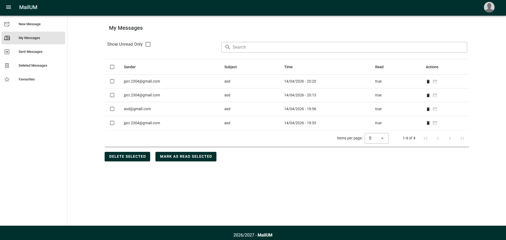

# Messaging App

Simple messaging application with a Vue frontend and Node.js backend.

## Home Page



## Features

- User registration and login  
- Send messages  
- View received messages  
- View sent messages  
- View deleted messages  

## Security

- **JWT Authentication:**
  Access to protected endpoints is secured using JSON Web Tokens.

- **Password Protection:**
  Passwords are hashed using **bcrypt** before being stored in the database.

- **Access Control:**
  Protected routes require a valid token and use middleware to validate requests.

- **Encrypted Messages:**
  Messages are encrypted using **RSA-OAEP with SHA-256**.

## Tech Stack

- **Frontend:** Vue 3, Vite, Vuetify  
- **Backend:** Node.js, Express  

## Setup & Run

### Frontend

Open frontend folder
```bash
cd client
```

Install project dependencies
```bash
npm install
```

Run the frontend app
```bash
npm run dev
```

### Backend

Open backend folder
```bash
cd server
```

Install project dependencies
```bash
npm install
```

Start the server
```bash
npm start
```
